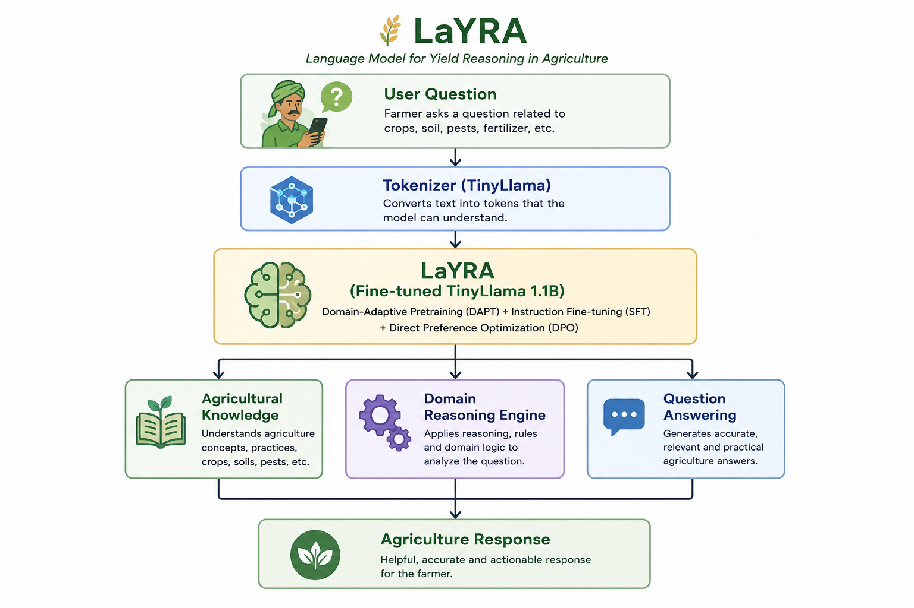
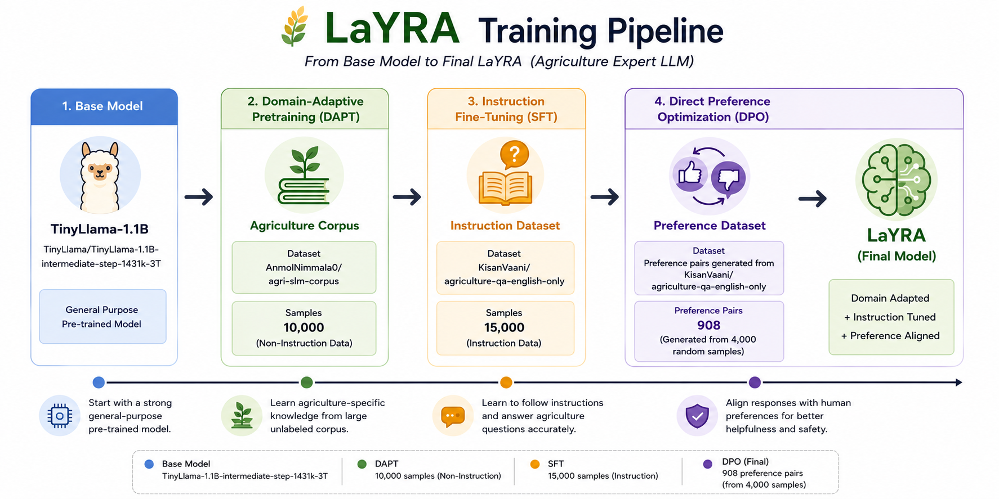
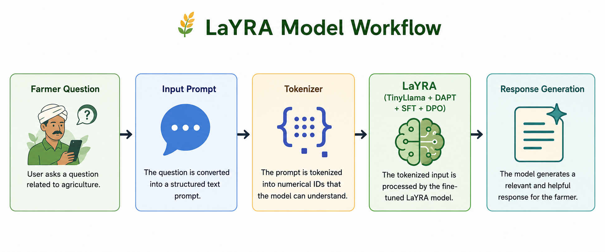
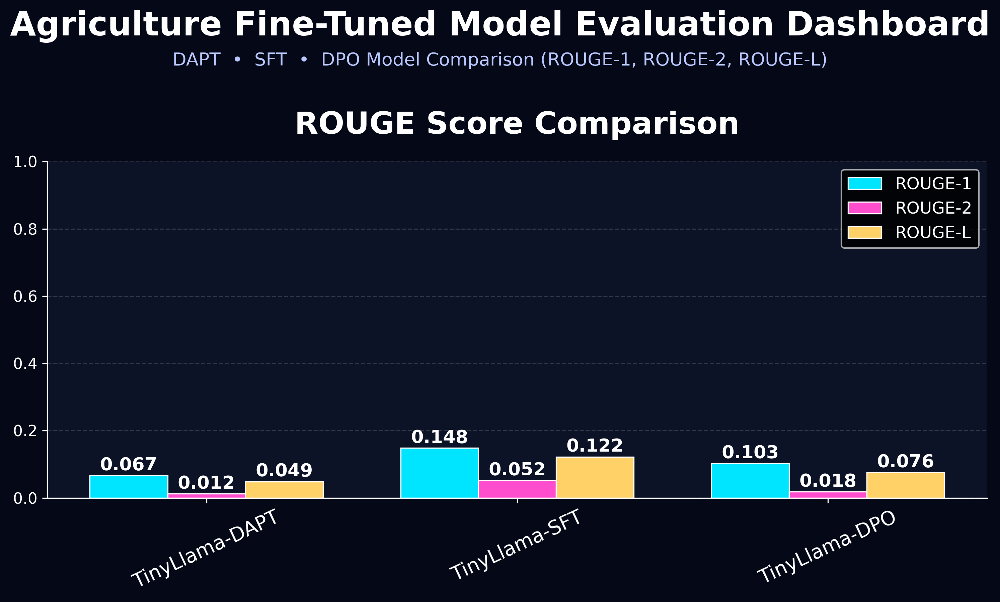

# LaYRA-Language-model-for-Yield-Reasoning-in-Agriculture
<div align="center">
🌾 LaYRA: Language Model for Yield Reasoning in Agriculture

> **A TinyLlama-based Agriculture Large Language Model specialized for agricultural reasoning and question answering.**




</div>

---

# 🌱 Overview

**LaYRA (Language Model for Yield Reasoning in Agriculture)** is a domain-specific Large Language Model developed by fine-tuning **TinyLlama/TinyLlama-1.1B-intermediate-step-1431k-3T** through a three-stage training pipeline consisting of **Domain-Adaptive Pretraining (DAPT)**, **Instruction Fine-Tuning (SFT)**, and **Direct Preference Optimization (DPO)**.

The model specializes in agricultural reasoning and question answering by learning domain-specific terminology, crop management, soil science, irrigation, fertilizers, pests, diseases, and modern farming practices.

---
# ✨ Features

- 🌾 Agriculture-specific Large Language Model
- 🧠 TinyLlama-1.1B based architecture
- 📚 Domain-Adaptive Pretraining (DAPT)
- 💬 Instruction Fine-Tuning (SFT)
- ⭐ Direct Preference Optimization (DPO)
- 🌱 Agricultural Question Answering
- 🌾 Crop & Soil Knowledge
- 🐛 Pest & Disease Understanding
- 💧 Irrigation & Fertilizer Guidance
- 📊 ROUGE & BERTScore Evaluation
- 🚀 Parameter-Efficient Fine-Tuning (LoRA)
- 🤗 Hugging Face Transformers Ecosystem
---

---

# ⚙ Training Pipeline
<div align="center">

</div>
---
---
| Stage | Dataset | Samples |
|--------|---------|---------:|
| 🌾 Domain-Adaptive Pretraining (DAPT) | AnmolNimmala0/agri-slm-corpus | 10,000 |
| 💬 Instruction Fine-Tuning (SFT) | KisanVaani/agriculture-qa-english-only | 15,000 |
| ⭐ Direct Preference Optimization (DPO) | Generated Preference Dataset | 908 Preference Pairs |
---


# 🔄 Model Workflow
<div align="center">

</div>
The workflow begins with an agricultural query, followed by prompt processing, tokenization, agriculture-specific reasoning using LaYRA, and natural language response generation.
---

# 📁 Repository Structure

```text
LaYRA/
│
├── notebooks/
│   ├── 01_domain_adaptive_pretraining.ipynb
│   ├── 02_instruction_finetuning.ipynb
│   ├── 03_preference_alignment_dpo.ipynb
│   └── 04_model_evaluation.ipynb
│
├── data/
│   ├── dataset_description.md
│   └── dataset_sources.md
│
├── docs/
│   ├── Architecture.png
│   ├── LaYRA_Training_Pipeline.png
│   └── Model_Workflow.png
│
├── metrics/
│   ├── Agriculture_DAPT_SFT_DPO_Evaluation_Metrics.csv
│   ├── agriculture_llm_evaluation_and_response_generation_sample_500.csv
│   └── evaluation_summary.md
│
├── visualizations/
│   ├── ROUGE_and_BERT_F1_Score.png
│   └── ROUGE_Score_Comparison.png
│
├── examples/
│   ├── sample_questions.md
│   ├── sample_outputs.md
│   └── comparison.md
│
├── .gitignore
├── LICENSE
├── README.md
└── requirements.txt
```

---
# 📂 Datasets

| Training Stage | Dataset |
|----------------|---------|
| Domain-Adaptive Pretraining | **AnmolNimmala0/agri-slm-corpus** |
| Instruction Fine-Tuning | **KisanVaani/agriculture-qa-english-only** |
| Direct Preference Optimization | Preference pairs generated from **KisanVaani/agriculture-qa-english-only** |

Detailed dataset documentation is available in:
- `data/dataset_description.md`
- `data/dataset_sources.md`
---

# 🛠 Technology Stack

| Category | Technologies |
|----------|--------------|
| Programming Language | Python |
| Deep Learning | PyTorch |
| LLM Framework | Hugging Face Transformers |
| Fine-Tuning | PEFT (LoRA) |
| Preference Alignment | TRL (DPO) |
| Dataset Library | Hugging Face Datasets |
| Evaluation | ROUGE, BERTScore F1|
| Kaggle | Jupyter Notebook |

---
# 💻 Training Environment
LaYRA was trained using Kaggle Notebooks with the following computational resources.

| Resource | Specification |
|----------|---------------|
| Platform | Kaggle Notebooks |
| GPU | Tesla T4 2X |
| GPU Memory | 15 GB × 2 (30 GB Total VRAM) |
| CPU | 4 vCPUs |
| CPU Memory| 30 GB RAM |
| Disk Memory| 57.6 GB |
---

# 📈 Training Summary
LaYRA was trained using a three-stage pipeline consisting of Domain-Adaptive Pretraining (DAPT), Instruction Fine-Tuning (SFT), and Direct Preference Optimization (DPO).

| Training Stage | Dataset | Epochs | Training Loss | Training Time |
|----------------|---------|-------:|--------------:|--------------:|
| Domain-Adaptive Pretraining (DAPT) | `AnmolNimmala0/agri-slm-corpus` (10,000 samples) | 5 | 1.7232 | 8h 16m 28s |
| Instruction Fine-Tuning (SFT) | `KisanVaani/agriculture-qa-english-only` (15,000 samples) | 2 | **0.1024** | 2h 12m 04s |
| Direct Preference Optimization (DPO) | Generated Preference Dataset (908 pairs) derived from `KisanVaani/agriculture-qa-english-only` | 2 | 0.4783 | 27m 10s |

> **Training Highlight:** The DPO stage achieved **91.67% reward accuracy**, demonstrating successful preference alignment between preferred and rejected responses.
> ---


# 📊 Evaluation
LaYRA was evaluated using standard Natural Language Generation (NLG) metrics to assess semantic similarity and response quality across different stages of fine-tuning.
## Evaluation Metrics

| Model | BERTScore F1 | ROUGE-1 | ROUGE-2 | ROUGE-L |
|-------|----------:|---------:|---------:|---------:|
| TinyLlama-DAPT | 0.4478 | 0.0670 | 0.0121 | 0.0487 |
| TinyLlama-SFT | 0.7019 | 0.1485 | 0.0519 | 0.1222 |
| TinyLlama-DPO | **0.8211** | 0.1028 | 0.0185 | 0.0763 |

The results demonstrate substantial improvements in semantic understanding after Instruction Fine-Tuning (SFT) and further enhancement through Direct Preference Optimization (DPO). While SFT achieves the highest ROUGE scores, DPO produces the best semantic similarity, reflected by the highest BERTScore.

## 📈 Evaluation Visualizations

<div align="center">

<br><hr><br>
  

</div>

# 📒 Project Notebooks

| Notebook | Description |
|----------|-------------|
| 01_domain_adaptive_pretraining.ipynb | Domain-Adaptive Pretraining |
| 02_instruction_finetuning.ipynb | Supervised Instruction Fine-Tuning |
| 03_preference_alignment_dpo.ipynb | Direct Preference Optimization |
| 04_model_evaluation.ipynb | Model Evaluation |
| 05_inference_demo.ipynb | Inference Examples |

---

# 🚀 Installation
```bash
git clone https://github.com/Iamdeepaksaxena/LaYRA-Language-model-for-Yield-Reasoning-in-Agriculture.git
```

# 📜 Citation
```bibtex
@misc{layra2026,
  title={LaYRA: Language Model for Yield Reasoning in Agriculture},
  author={Deepak Kumar},
  year={2026},
  howpublished={GitHub Repository}
}
```

---
# 📄 License

This project is licensed under the **Apache License 2.0**.

---

# 👨‍💻 Author

**Deepak Kumar**

AI/ML Engineer • Large Language Models • NLP • Deep Learning

---

<div align="center">

### ⭐ If you find this project useful, consider giving it a Star!

**Made with ❤️ for Agriculture, AI, and Open Source.**

</div>
